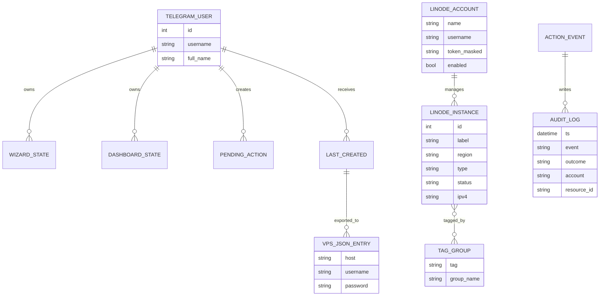

# 🚀 Linode Telegram Bot — Visual VPS Control Center

<p align="center">
  <b>Bot Telegram buat create, manage, monitor, export, delete, group, audit Linode/VPS via Linode API v4.</b><br>
  Fokus: cepat, visual, multi akun API, aman dari secret leak, enak dipakai lewat tombol.
</p>

<p align="center">
  
  
  
  
</p>

---

## 📌 Deskripsi projek

Project ini adalah bot Telegram untuk mengelola server Linode/VPS dari Telegram, tanpa perlu buka dashboard web Linode. Bot ini dibuat buat flow yang butuh gerak cepat: create VPS banyak sekaligus, pilih region/type/image via tombol, pakai beberapa token API Linode, sebar create ke banyak akun, cek quota akun, export data VPS, append otomatis ke inventory lokal, kelola group/tag, sampai delete massal dengan konfirmasi aman.

Target utama bot ini bukan cuma “bisa create VPS”, tapi jadi control center kecil yang rapi. Dari Telegram, user bisa buka `/wizard` untuk create visual, `/dashboard` untuk lihat semua VPS, filter status/region/account/search, pilih beberapa VPS, lalu reboot/delete/resize/export. Kalau mau CLI juga tetap ada: `/create account=smart region=auto smart=true type=g6-standard-1 image=linode/ubuntu22.04 label=web count=3 group=prod`.

Bot ini memakai Linode API v4 langsung via `httpx`, framework Telegram memakai `python-telegram-bot`, config sensitif dipisah ke `.env` dan `tokens.json`, lalu dua file itu masuk `.gitignore`. Jadi repo tetap aman buat dipush ke GitHub tanpa token Telegram, token Linode, password VPS, audit log, export, atau inventory private ikut ke-commit.

---

## ✨ Fitur utama

| No | Fitur | Status |
|---:|---|---|
| 1 | Visual delete single/mass/all VPS via dashboard | ✅ selesai |
| 2 | Dashboard visual filter account/region/status/search + actions | ✅ selesai |
| 3 | Create ke account `all/spread`, random, roundrobin, smart | ✅ selesai |
| 4 | Quota/capacity checker sebelum create | ✅ selesai |
| 5 | Smart create auto account/region + retry best-effort | ✅ selesai |
| 6 | Export VPS JSON/TXT/WA/TG-ready, termasuk last created | ✅ selesai |
| 7 | Auto append created VPS ke `/root/work/gen3-vps/vps.json` | ✅ selesai |
| 8 | Tags/groups: create/list/delete/reboot/export group | ✅ selesai |
| 9 | Account health `/quota` / `/health` | ✅ selesai |
| 10 | Audit log JSONL untuk action penting | ✅ selesai |

---

## 🧠 Cara kerja singkat

Bot jalan sebagai Telegram polling process. Saat user mengirim command atau klik tombol inline, handler di `bot.py` memvalidasi whitelist `ALLOWED_USER_IDS`. Setelah lolos, bot membaca state user dari memory runtime: wizard state, dashboard filter, pending create, pending action, last created VPS, dan cache health/catalog.

Untuk call Linode API, bot memilih account sesuai mode: specific, random, roundrobin, spread, atau smart. Specific artinya pakai satu token tertentu. Random memilih account acak. Roundrobin rotasi account per VPS. Spread menyebar total count ke semua account enabled. Smart memilih account sehat dan region pool yang lebih fleksibel, lalu retry jika ada error quota/capacity/transient.

Create flow selalu bikin plan, menampilkan ringkasan biaya estimasi, root password hidden sampai sukses, preflight quota, lalu user klik confirm. Setelah VPS sukses dibuat, bot menyimpan hasil ke `LAST_CREATED` runtime supaya bisa export password root yang baru muncul. Kalau `AUTO_APPEND_CREATED_VPS=true`, bot append IP + username + password ke `/root/work/gen3-vps/vps.json` dengan dedupe IP dan file mode `0600`.

Delete/reboot/resize massal memakai pending action ID, bukan menyimpan target besar di callback_data. Untuk action bahaya ke lebih dari satu VPS, bot mewajibkan user mengetik kata konfirmasi seperti `DELETE`, `REBOOT`, atau `RESIZE`. Ini mencegah klik salah yang bisa menghancurkan banyak VPS.

---

## 🏗️ Arsitektur project

```text
linode-telegram-bot/
├── bot.py                 # semua logic bot: Telegram handlers, Linode API, wizard, dashboard, groups, audit
├── requirements.txt       # dependency runtime + test
├── pytest.ini             # config pytest async
├── tests/
│   └── test_bot_core.py   # unit tests core flow tanpa call API asli
├── .env.example           # contoh config aman
├── tokens.example.json    # contoh multi account aman
├── .gitignore             # secret/log/export/cache ignored
└── README.md              # dokumentasi utama ini
```

### Komponen internal

1. **Config loader** — membaca `.env`, default region/type/image, max count, path inventory, audit log, export dir, dan token file.
2. **Account manager** — load `tokens.json`, normalize account name, masking token, mode account specific/random/roundrobin/spread/smart.
3. **Linode API client** — helper `linode_request()` dan `get_paginated()` untuk call Linode API v4.
4. **Catalog cache** — cache region/type/image agar picker visual tidak lambat dan tidak spam API.
5. **Wizard state** — state per user untuk `/wizard`, tombol account, region, type, image, count, label, tags, group, root password, backups, private IP, save JSON.
6. **Dashboard state** — filter account/region/status/search, pagination, selected VPS, bulk actions.
7. **Create planner** — parse CLI/wizard, validate count max 10, include group tag, estimate price, preflight quota.
8. **Smart create** — retry account/region sesuai klasifikasi error, fallback best-effort tanpa janji palsu.
9. **Inventory writer** — append VPS baru ke JSON lokal, atomic write, dedupe, chmod 600.
10. **Exporter** — JSON/TXT/WA/TG-ready, existing VPS tanpa password, newly-created bisa include password runtime.
11. **Groups/tags** — memakai native Linode tags dengan format `group:nama`.
12. **Audit logger** — append-only JSONL, redaksi key sensitif.
13. **Unit tests** — coverage core parser, distribution, dashboard filter, export redaction, audit redaction, quota preflight, pending mass confirmation.

---

## 🔁 Flowchart utama

```mermaid
flowchart TD
    A[User Telegram] --> B{Whitelist ALLOWED_USER_IDS?}
    B -- Tidak --> Z[Reject + audit auth.denied]
    B -- Ya --> C{Command / Callback}
    C --> D[/wizard Visual Create]
    C --> E[/dashboard Manage VPS]
    C --> F[/quota Account Health]
    C --> G[/group Tags/Groups]
    C --> H[/export Data VPS]

    D --> I[Build plan]
    I --> J[Catalog region/type/image]
    I --> K[Preflight quota]
    K --> L{Confirm create?}
    L -- Cancel --> M[Drop pending plan]
    L -- Confirm --> N[Create Linode API]
    N --> O{Success?}
    O -- Ya --> P[Save LAST_CREATED]
    P --> Q{AUTO_APPEND_CREATED_VPS?}
    Q -- Ya --> R[Append vps.json + chmod 600]
    Q -- Tidak --> S[Reply result]
    R --> S
    O -- Tidak --> T[Classify error + retry if smart]
    T --> N

    E --> U[Fetch instances all/scope]
    U --> V[Filter account/region/status/search]
    V --> W[Select single/mass/all]
    W --> X{Dangerous multi action?}
    X -- Ya --> Y[Require typed DELETE/REBOOT/RESIZE]
    X -- Tidak --> AA[Confirm button]
    Y --> AB[Execute API action]
    AA --> AB
    AB --> AC[Audit success/fail]
```

---

## 🧩 ERD / data relationship



---

## ⚙️ Setup cepat

```bash
cd /root/work/linode-telegram-bot
python3 -m venv .venv
. .venv/bin/activate
pip install -r requirements.txt
cp .env.example .env
cp tokens.example.json tokens.json
```

Edit `.env`:

```env
TELEGRAM_BOT_TOKEN=isi-token-bot-telegram
ALLOWED_USER_IDS=123456789
LINODE_TOKENS_FILE=tokens.json
DEFAULT_REGION=ap-south
DEFAULT_TYPE=g6-standard-1
DEFAULT_IMAGE=linode/ubuntu22.04
MAX_COUNT=10
AUTO_APPEND_CREATED_VPS=true
GEN3_VPS_FILE=/root/work/gen3-vps/vps.json
AUDIT_LOG_FILE=./logs/audit.jsonl
EXPORT_DIR=./exports
```

Edit `tokens.json`:

```json
{
  "accounts": [
    {
      "name": "account-utama",
      "username": "username-linode",
      "token": "isi-token-linode",
      "enabled": true
    }
  ]
}
```

Jalankan bot:

```bash
. .venv/bin/activate
python bot.py
```

> Catatan keamanan: `.env`, `tokens.json`, `logs/`, `exports/`, `.venv/`, cache, dan file JSONL tidak ikut Git. Jangan commit token atau password. Kalau token sudah pernah tersebar, rotasi token dari panel terkait.

---

## 🧾 Command penting

### General

```text
/start          buka menu utama
/help           lihat contoh command
/whoami         cek Telegram user id buat whitelist
/refresh        refresh catalog region/type/image + reload accounts
```

### Account & quota

```text
/accounts       list account/token masked
/account NAME   pilih account spesifik
/account random pilih random account
/account roundrobin pilih rotasi account
/account spread sebar create ke semua enabled accounts
/account smart  pilih smart mode
/quota all      cek health/quota semua account
/health NAME    cek health account tertentu
```

### Create

```text
/wizard
/create account=smart region=auto smart=true type=g6-standard-1 image=linode/ubuntu22.04 label=web count=3 group=prod tags=bot,prod
/create account=spread region=random type=g6-standard-1 image=linode/ubuntu22.04 label=batch count=10
/create account=acc1 region=id-cgk type=g6-standard-1 image=linode/ubuntu22.04 label=single count=1 backups=false private_ip=false
```

### Dashboard & actions

```text
/dashboard      dashboard visual: filter, select, delete, reboot, resize, export
/list all       list semua VPS semua account
/delete ID      delete manual di active specific account
/delete acc1 ID delete manual di account tertentu
```

### Export

```text
/export all txt
/export all json
/export acc1 txt
/export new txt
/export_new json
```

Existing VPS dari API Linode tidak bisa menampilkan root password karena Linode API memang tidak mengembalikan root password. Password hanya tersedia untuk VPS yang baru dibuat di sesi runtime `LAST_CREATED`, atau kalau auto append aktif maka masuk ke `/root/work/gen3-vps/vps.json`.

### Groups / tags

```text
/groups all
/group create prod count=2 account=spread region=random type=g6-standard-1 image=linode/ubuntu22.04
/group list prod all
/group export prod all json
/group reboot prod all
/group delete prod all
```

Group diimplementasi memakai tag Linode native dengan format `group:prod`, jadi tetap kelihatan di dashboard Linode asli.

---

## 🖼️ Screenshot halaman / flow

Screenshot di bawah adalah mock visual berbasis tampilan Telegram bot aktual, ditaruh langsung di README agar dokumentasi tetap satu file. Struktur tombol, teks, dan halaman mengikuti flow bot.

### 1. Menu utama

```text
┌────────────────────────────────────────────┐
│ Linode bot ready.                          │
│                                            │
│ Visual: /create /wizard /dashboard         │
│ Cmd: /accounts /quota /groups /export      │
├────────────────────────────────────────────┤
│ [🚀 Visual Create]   [📋 Dashboard]        │
│ [👤 Accounts]        [🩺 Health/Quota]     │
│ [👥 Groups]          [📤 Export]           │
│ [🔄 Scrape Catalog]                       │
│ [🌍 Regions] [📦 Types] [💿 Images]       │
└────────────────────────────────────────────┘
```

### 2. Visual builder / wizard

```text
┌────────────────────────────────────────────┐
│ 🚀 Visual Linode Builder                   │
│ Pilih via tombol. Catalog live Linode API. │
│                                            │
│ 👤 account: SMART best account             │
│ 🌍 region: RANDOM per VPS                  │
│ 🧠 smart: True                             │
│ 📦 type: g6-standard-1                     │
│ 💿 image: linode/ubuntu22.04               │
│ 🔢 count: 3/10                             │
│ 🏷 label: web-prod                         │
│ 👥 group: prod                             │
│ 📥 save_vps_json: True                     │
├────────────────────────────────────────────┤
│ [👤 Account] [🌍 Region]                  │
│ [🎲 Random region ON] [🧠 Smart ON]       │
│ [📦 Plan/Type] [💿 Image]                 │
│ [🔢 Count] [🏷 Label]                     │
│ [👥 Group] [🏷 Tags]                      │
│ [👀 Preview] [✅ Build + Confirm]          │
└────────────────────────────────────────────┘
```

### 3. Account picker

```text
┌────────────────────────────────────────────┐
│ 👤 Pilih Account/API                       │
├────────────────────────────────────────────┤
│ [🧠 SMART BEST ACCOUNT]                    │
│ [🌐 SPREAD/ALL ACCOUNTS]                   │
│ [🎲 RANDOM ACCOUNT PER VPS]                │
│ [🔁 ROUND-ROBIN ACCOUNTS]                  │
│ [👤 acc1 (username)]                       │
│ [👤 acc2 (username)]                       │
│ [⬅️ Menu]                                  │
└────────────────────────────────────────────┘
```

### 4. Region/type/image picker

```text
┌────────────────────────────────────────────┐
│ 🌍 Pilih Region page 1/N                   │
├────────────────────────────────────────────┤
│ [🎲 RANDOM REGION PER VPS]                 │
│ [🧠 AUTO REGION SMART]                     │
│ [ap-south - Mumbai]                        │
│ [id-cgk - Jakarta]                         │
│ [sg-sin - Singapore]                       │
│ [us-east - Newark]                         │
│ [⬅️ Menu] [Next ➡️]                        │
└────────────────────────────────────────────┘
```

### 5. Preview create + quota preflight

```text
┌────────────────────────────────────────────┐
│ Plan create Linode                         │
│ account: SMART best account                │
│ region: RANDOM per VPS                     │
│ smart: True                                │
│ type: g6-standard-1                        │
│ image: linode/ubuntu22.04                  │
│ label: web-prod-01..                       │
│ count: 3                                   │
│ group: prod                                │
│ est: $0.036/hour | $24.00/month            │
│                                            │
│ Preflight                                  │
│ ✅ quota preflight OK                      │
│ root_pass: hidden sampai create sukses     │
├────────────────────────────────────────────┤
│ [Confirm create] [Cancel]                  │
└────────────────────────────────────────────┘
```

### 6. Create result + export new

```text
┌────────────────────────────────────────────┐
│ Create result                              │
│ ✅ web-prod-01 id=123 account=acc1 ip=...  │
│ ✅ web-prod-02 id=124 account=acc2 ip=...  │
│ ✅ web-prod-03 id=125 account=acc1 ip=...  │
│ vps.json: added=3 skipped=0 path=...       │
│ root_pass: ********                        │
│ Simpan sekarang.                           │
├────────────────────────────────────────────┤
│ [📤 Export new JSON] [📄 Export new TXT]   │
│ [📋 Dashboard]                             │
└────────────────────────────────────────────┘
```

### 7. Dashboard filter/search/actions

```text
┌────────────────────────────────────────────┐
│ 📋 VPS Dashboard                           │
│ account=all region=all status=running      │
│ search=web selected=2 page=1/3             │
│                                            │
│ ✅ 1. acc1 123 web-prod-01 running 1.1.1.1 │
│ ⬜ 2. acc2 124 web-prod-02 running 2.2.2.2 │
├────────────────────────────────────────────┤
│ [✅ web-prod-01] [🗑] [🔁]                 │
│ [⬜ web-prod-02] [🗑] [🔁]                 │
│ [👤 Account] [🌍 Region] [🟢 Status]      │
│ [🔎 Search] [☑️ Select page] [🧹 Clear]   │
│ [🗑 Delete selected] [🔁 Reboot selected] │
│ [📦 Resize selected] [📤 Export selected] │
│ [☢️ Delete ALL filtered] [⬅️ Main]        │
└────────────────────────────────────────────┘
```

### 8. Mass delete confirmation

```text
┌────────────────────────────────────────────┐
│ Confirm delete                             │
│ targets: 3                                 │
│ - acc1 123 web-prod-01                     │
│ - acc2 124 web-prod-02                     │
│ - acc1 125 web-prod-03                     │
│                                            │
│ Ketik DELETE untuk lanjut.                 │
├────────────────────────────────────────────┤
│ [Cancel]                                   │
└────────────────────────────────────────────┘
```

### 9. Account health / quota

```text
┌────────────────────────────────────────────┐
│ Account Health / Quota                     │
│ 🟢 acc1 status=ok quota=6/10 used=4        │
│ 🟡 acc2 status=warn quota=? used=2         │
│ 🔴 acc3 status=block token/account error   │
└────────────────────────────────────────────┘
```

### 10. Groups page

```text
┌────────────────────────────────────────────┐
│ Groups - all                               │
│ prod: 5 VPS                                │
│ staging: 2 VPS                             │
│ scraper: 10 VPS                            │
└────────────────────────────────────────────┘
```

### 11. Export output TXT / WA-ready

```text
web-prod-01 | 1.1.1.1 | root | - | acc1 | id-cgk | g6-standard-1 | running
web-prod-02 | 2.2.2.2 | root | - | acc2 | sg-sin | g6-standard-1 | running
```

### 12. Audit log JSONL

```json
{"ts":"2026-05-15T12:34:56Z","event":"linode.create.success","outcome":"success","user":{"id":123456789,"username":"admin","name":"Admin"},"account":"acc1","resource":{"type":"linode","id":123,"label":"web-prod-01"},"request":{"region":"id-cgk","type":"g6-standard-1","root_pass":"***"},"meta":{},"error":null}
```

---

## 🔐 Keamanan

- `.env` tidak dicommit.
- `tokens.json` tidak dicommit.
- `logs/` tidak dicommit.
- `exports/` tidak dicommit.
- `*.jsonl` tidak dicommit.
- root password cuma tampil saat create sukses, lalu bisa disimpan ke inventory lokal kalau fitur save aktif.
- Export existing VPS tidak menampilkan root password karena Linode API tidak menyediakannya.
- Audit log meredaksi key sensitif: token, password, root_pass, authorization.
- Mass delete/reboot/resize butuh confirm typed keyword kalau target lebih dari satu.
- `ALLOWED_USER_IDS` wajib diisi supaya bot tidak bisa dipakai semua orang.

---

## 🧪 Testing

Test dijalankan dengan:

```bash
. .venv/bin/activate
python -m py_compile bot.py tests/test_bot_core.py
pytest -q
```

Hasil terakhir:

```text
............                                                             [100%]
12 passed in 0.40s
```

Coverage flow yang dicek:

- parser account mode: random, roundrobin, spread/all, smart, specific.
- tag group sanitizer.
- plan builder menambah `group:nama` ke tags.
- spread distribution lintas account.
- dashboard filter status/region/search.
- append inventory `vps.json` atomic + dedupe + chmod 600.
- export redaction existing password.
- export last-created include password saat allowed.
- audit log redaction untuk token/root_pass.
- preflight quota blocker.
- smart preflight memilih account sehat.
- pending action mass delete wajib keyword `DELETE`.
- classify Linode error transient/account/region.

---

## 📊 Statistik repo

| Metric | Nilai |
|---|---:|
| Branch | `master` |
| Commit lokal | `9+` |
| File tracked | `8+` |
| Test terakhir | `12/12 passed` |
| Bahasa utama | Python |
| Framework Telegram | python-telegram-bot |
| API cloud | Linode API v4 |
| Dokumentasi utama | README.md ini |

---

## 🧑‍💻 Kontributor

- **Tamas / Owner** — ide fitur, requirement, testing arah produk, token/API owner.
- **AI Assistant** — implementasi bot, struktur repo, safety flow, tests, README, audit, dashboard, multi-account.

---

## 🚧 Catatan GitHub repo

Repo lokal sudah disiapkan aman untuk dipush. Metadata GitHub seperti description dan topics bisa diupdate via GitHub token, tapi token GitHub tidak boleh ditulis ke file atau dicetak ke output. Kalau token GitHub tersedia di environment atau `gh auth`, update yang disarankan:

- Description: `Telegram bot visual untuk create/manage Linode VPS multi-account via Linode API v4.`
- Topics: `telegram-bot`, `linode`, `vps`, `python`, `cloud-automation`, `devops`, `multi-account`, `infrastructure`, `dashboard`, `api-v4`.

Command aman kalau `gh` sudah login:

```bash
gh repo edit --description "Telegram bot visual untuk create/manage Linode VPS multi-account via Linode API v4." --add-topic telegram-bot --add-topic linode --add-topic vps --add-topic python --add-topic cloud-automation --add-topic devops --add-topic multi-account --add-topic infrastructure --add-topic dashboard --add-topic api-v4
```

---

## ✅ Status akhir

Bot sekarang sudah menjadi control center Linode Telegram dengan create visual, dashboard mass action, quota/health, smart create, export, inventory append, groups/tags, audit log, tests, dan README lengkap satu file. Semua fitur dibuat tetap sadar batasan API Linode: root password tidak bisa diambil ulang dari VPS existing, quota/capacity preflight bersifat best-effort karena cloud capacity bisa berubah saat create, dan action destructive selalu diberi guard konfirmasi.
